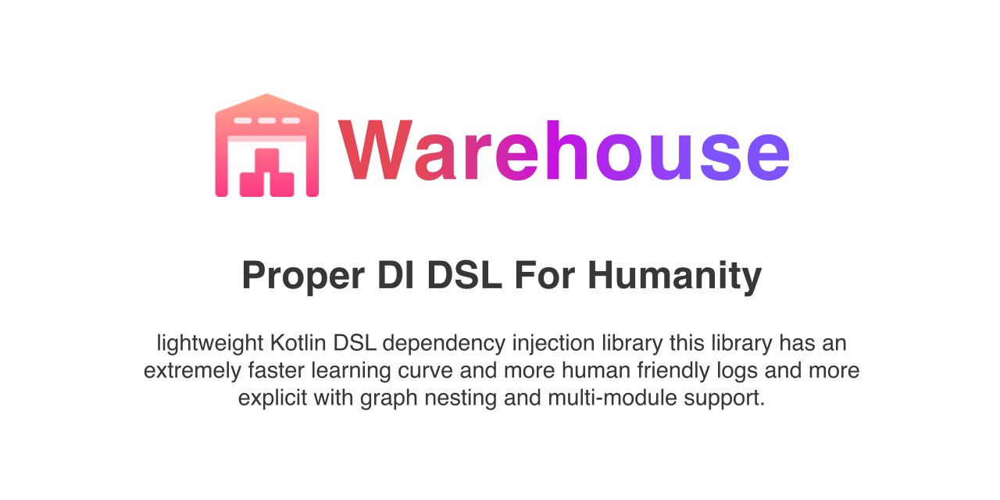

<div align="center">
  <br>
	<a href="https://osama-raddad.github.io/Warehouse/">
  
		</a>
  <br>  
  <p align="center">
  </p>
</div>


## Warehouse DSL

[](https://www.codacy.com/gh/osama-raddad/Warehouse/dashboard?utm_source=github.com&amp;utm_medium=referral&amp;utm_content=osama-raddad/Warehouse&amp;utm_campaign=Badge_Grade)
[](https://www.codacy.com/gh/osama-raddad/Warehouse/dashboard?utm_source=github.com&utm_medium=referral&utm_content=osama-raddad/Warehouse&utm_campaign=Badge_Coverage)
[](https://opensource.org/licenses/Apache-2.0)

[](https://jitpack.io/#osama-raddad/Warehouse)

Warehouse is a lightweight Kotlin DSL dependency injection library this library has an extremely faster learning curve and
more human friendly logs and more explicit it has graph nesting and multi-module support.

### Create

```kotlin
val mainDI = warehouse(Accessibility.LOCAL) {
    warehouse { namesDI } // add another warehouse in the currunt warehouse
    module {
        factory {
	    name {"GoodPerson"} // this object is named GoodPerson (optional)
            constructor { GoodPerson(param(FIRST_NAME), param(LAST_NAME)) }
            injectsIn { Demo::class } // restruct injecting this object just to Demo class (optional)
            creation { CreationPattern.REUSABLE } // make this object reusable (optional)
            contract { Person::class } //retreve this object as an object of type Person (optional)
        }
    }
}
```

### Use

```kotlin
class Demo {
    @Named("GoodPerson")
    private val goodPerson: Person by mainDI()
}
```

## Install

Add it in your root build.gradle at the end of repositories:

```kotlin
allprojects {
	repositories {
		...
        maven { url 'https://jitpack.io' }
	}
}
```

Step 2. Add the dependency

```kotlin
	dependencies {
    implementation 'com.github.osama-raddad:Warehouse:1.4.8x'
	}
```

## Contributing

We welcome contributions to Warehouse!

* ⇄ Pull requests and ★ Stars are always welcome.

### Let me know!

I’d be really happy if you sent me links to your projects where you use my library. Just send an email to
osama.s.raddad@gmail.com And do let me know if you have any questions or suggestion regarding the library.

## License

    Copyright 2022, Osama Raddad

    Licensed under the Apache License, Version 2.0 (the "License");
    you may not use this file except in compliance with the License.
    You may obtain a copy of the License at

       http://www.apache.org/licenses/LICENSE-2.0

    Unless required by applicable law or agreed to in writing, software
    distributed under the License is distributed on an "AS IS" BASIS,
    WITHOUT WARRANTIES OR CONDITIONS OF ANY KIND, either express or implied.
    See the License for the specific language governing permissions and
    limitations under the License.

